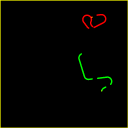
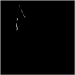

.. _environments:

Environments
==================================
There are 4 environments available. You should use KuruveGymEnv as a base for other environments.
Remember to check the action and observations spaces for each environment.

GymEnv/KuruveGymEnv
----------------------------------
Example image (96x96) of the observation:

.. module:: kuruve.envs.GymEnv
.. autoclass:: KuruveGymEnv
   :members:
   
SurvivalEnv
-----------------------------------
.. module:: kuruve.envs.SurvivalEnv
.. autoclass:: SurvivalEnv

CompetitiveEnv
-----------------------------------
Example images (96x96) of the observation:

Left image: grayscale image of the screen. Right image: player's (1) position.

.. module:: kuruve.envs.CompetitiveEnv
.. autoclass:: CompetitiveEnv

RandomEnv
-----------------------------------
.. module:: kuruve.envs.RandomEnv
.. autoclass:: RandomEnv

